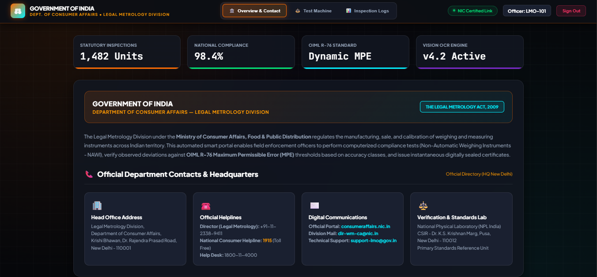
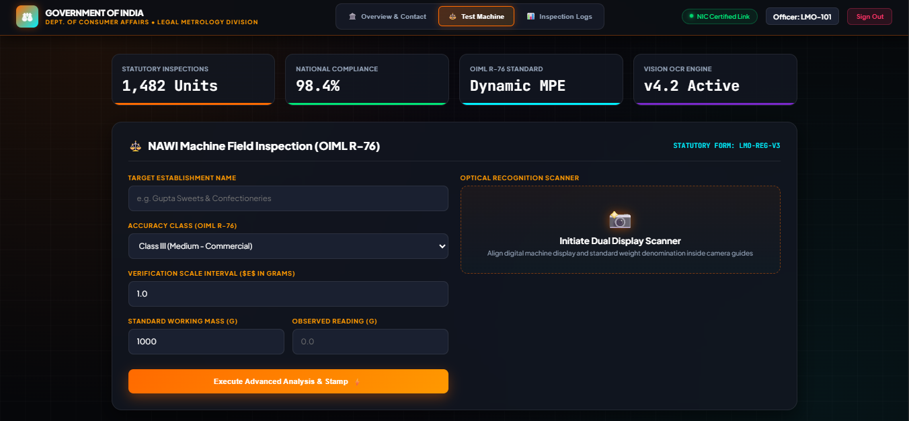

# 🏛️ LMO Portal (Legal Metrology & Certificate Management System)

> A comprehensive full-stack web application designed for efficient certificate generation, official record tracking, and streamlined administrative workflows.

---

## ✨ Features

* **📄 Automated Certificate Management:** Secure generation, storage, and retrieval of official verification and calibration certificates (PDF formats).
* **⚡ Modular Backend Architecture:** Structured using dedicated Python application modules (`app1.py`, `app2.py`, `app3.py`) to manage distinct portal services.
* **🗄️ Robust Database Integration:** Lightweight local database management via SQLite (`instance/` directory) ensuring reliable state handling and fallback support.
* **🎨 Clean Responsive UI:** Dynamic HTML templates designed for smooth administrative interactions and seamless user navigation.

---

## 🛠️️ Tech Stack

* **Backend:** Python, Flask / WSGI frameworks, Database Management
* **Frontend:** HTML5, CSS3, Jinja Templating
* **Document Handling:** PDF Generation & Management utilities

---
## 🖥️ Preview Dashboard





## 📂 Project Structure

```text
LMO_PORTAL_SIH/
│
├── app1.py                 # Primary application module
├── app2.py                 # Secondary service module
├── app3.py                 # Extended operational module
├── certificates/           # Generated official PDF certificates
├── instance/               # Local database storage (SQLite)
└── templates/              # HTML frontend layout templates
